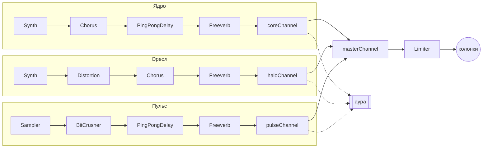

# Аура

Веб-синтезатор, который рисует ауру звуком. Прототип к предпросмотру по арт-практике «Интерактивный дизайн».


## Концепция

В центре экрана светящийся шар, аура: белая серединка, розовое тело, тёплый жёлтый ореол по краю и тонкие кольца вокруг. Пока тишина, шар маленький и бледный. Когда начинаешь играть, он растёт, разгорается и мягко мнётся: чем больше голосов звучит и чем они громче, тем больше энергии. Удары барабанов заставляют его вздрагивать, а кольца расходятся. Выключаешь голоса, и аура гаснет.

Исполнитель не просто играет музыку, а создаёт энергию, и её видно. Каждая ручка меняет и звук, и ауру.

## Из чего состоит инструмент

| Голос | Роль | Источник звука | Цепочка эффектов |
| --- | --- | --- | --- |
| **Ядро** | синт 1, высокая мелодия | `Tone.PolySynth`, 4 формы волны | хорус → эхо → зал |
| **Ореол** | синт 2, бас и подклад | `Tone.PolySynth`, 4 формы волны | искажение → хорус → зал |
| **Пульс** | барабаны | `Tone.Sampler`, сэмплы Roland TR‑909 | крошка → эхо → зал |

Эффекты: Chorus (хорус), PingPongDelay (эхо), Freeverb (зал), Distortion (искажение), BitCrusher (крошка).

## Каналы: куда идёт звук

У каждого голоса свой канал `Tone.Channel` с громкостью, панорамой и выключателем. Каналы сходятся в общий канал, а оттуда через лимитер в колонки. К каждому каналу подключён `Tone.Meter`: он измеряет громкость голоса, и по ней аура понимает, сколько в музыке энергии.



Все каналы стерео (`channelCount: 2`), поэтому панорама слышна в наушниках: голос можно увести в левое или правое ухо. Исходно Ядро чуть правее, Ореол чуть левее, Пульс по центру.

## Как звук управляет аурой

Ауру рисует библиотека p5.js. Каждый голос отвечает за свою часть шара, а ручки меняют его характер.

| Что делаешь | Что происходит с аурой | Почему так |
| --- | --- | --- |
| играет Ядро | белая серединка разгорается и вспыхивает на каждой ноте | Ядро это мелодия, сердце музыки |
| играет Ореол | шар растёт, светится сильнее и окрашивает фон | Ореол это бас, он «обнимает» всю музыку |
| удар Пульса | шар вздрагивает, кольца расходятся | удар как толчок энергии |
| настроение | фон: в тишине прохладный голубой, при энергии тёплый розовый, от резкого звука (искажение, крошка, пила, квадрат) глубокий фиолетовый | фон показывает общее настроение музыки |
| настроение | по фону медленно плывут едва заметные размытые круги, их цвет меняется вместе с настроением | глубина и ощущение живого пространства вокруг ауры |
| выключаешь голос | его цвет уходит, шар бледнеет | нет голоса, нет его энергии |
| панорама | часть шара сдвигается влево или вправо: серединка за Ядром, тело за Ореолом, кольца за Пульсом | видно, где в пространстве звучит голос |
| форма волны | цвет: синус розовый, треугольник персиковый, квадрат лавандовый, пила коралловый | мягкий звук даёт мягкий цвет, резкий даёт яркий |
| зал | свечение вокруг шара шире и мягче | звук в большом зале тоже расплывается |
| эхо | колец становится больше | эхо повторяет звук, кольца повторяют шар |
| хорус | шар переливается и плывёт быстрее | хорус делает звук «качающимся» |
| искажение | шар сильнее мнётся | искажение «ломает» звук |
| крошка | больше зерна | крошка делает звук зернистым |
| громкость | больше громкости, больше энергии |  |

## Элементы интерфейса

| Компонент | Что делает |
| --- | --- |
| `TopBar` | общий пульт: темп, общая громкость, запуск |
| `PlayButton` | играть и остановить (также пробел) |
| `Voice` | стеклянная панель голоса: Ядро слева, Ореол справа, Пульс снизу |
| `ToggleButton` | включает и выключает голос |
| `PatternSwitch` | узор: спокойный (● · ● ·) или плотный (●●●●●●●●) |
| `WaveSwitch` | форма волны: синус, треугольник, квадрат, пила |
| `Fader` | ползунок: сила эффекта, громкость, панорама, темп |
| `AuraCanvas` | живая аура в центре (p5.js) |
| `Grain` | зерно поверх картинки |

Каждая панель голоса устроена одинаково сверху вниз: имя и вкл, узор, форма волны, цепочка эффектов (ползунки идут в том же порядке, в каком через них проходит звук), канал с громкостью и панорамой.

## Нейминг

Одно правило для кода и для макета: **сначала голос, потом тип узла, потом что это.**

- голоса: `core` (Ядро), `halo` (Ореол), `pulse` (Пульс), `master` (общий выход)
- настройки: `coreSynthSettings`, `haloDistortionSettings`, `pulseFreeverbSettings`
- ноты: `coreSequenceI`, `coreSequenceII`, `pulseSequenceI`
- в HTML голос находится по `data-voice="core"`, эффект по `data-effect="reverb"`
- компоненты интерфейса названы с большой буквы, как в Figma: `Voice`, `Fader`, `WaveSwitch`

## Файлы

```
index.html          разметка: пульт и три панели голосов
css/reset.css       сброс стилей браузера
css/style.css       визуальный стиль
js/settings.js      настройки голосов, эффектов и каналов
js/sequences.js     ноты: по два узора на голос
js/audio.js         сборка звука: цепочки, каналы, узоры
js/aura.js          живая аура на p5.js, которая слушает звук
js/interface.js     связь кнопок и фейдеров с голосами
samples/            5 сэмплов Roland TR‑909
favicon.svg         значок вкладки
.prettierrc         правила оформления кода (как в репозитории курса)
.gitignore          служебные файлы, которые не попадают в репозиторий
```

## Музыка

До мажор, темп 96. Гармония на 4 такта: Fmaj7 → Em7 → Dm7 → Cmaj7, мягкий спуск вниз.

- **Ядро.** Спокойно: арпеджио четвертями. Плотно: переливы восьмыми.
- **Ореол.** Спокойно: одна долгая нота на такт. Плотно: пульсирующий бас.
- **Пульс.** Спокойно: мягкий шаг бочки с римшотом. Плотно: полный бит с малым барабаном и хэтами.

### Сценарий сета

1. **Тишина.** Бледный экран.
2. **Ореол.** Включаем только его, появляется мягкое свечение.
3. **Ядро.** Внутри загорается свет.
4. **Пульс.** Аура начинает биться.
5. **Пик.** Плотные узоры, эхо и хорус вверх, пробуем пилу и квадрат. Аура огромная и яркая.
6. **Растворение.** Возвращаем спокойные узоры, зал вверх, выключаем голоса по одному.

## Как я использовала нейросеть

В работе мне помогала нейросеть Claude.

**Что делала я**

- выбрала идею ауры и собрала визуальные референсы с мягкими градиентами
- придумала, как выглядит аура: нарисовала макет шара (белая серединка, розовое тело, тёплое свечение и тонкие кольца)
- выбрала раскладку и задавала общий стиль: стекло, цвета, шрифт, круги на фоне
- проверяла, как звучит и выглядит инструмент, и искала ошибки в браузере
- придумала, как голоса связаны с частями ауры, и собрала сценарий сета

**Для чего я использовала нейросеть**

- **Код.** Написать код звука на Tone.js и анимации ауры на p5.js по моему описанию, а потом исправлять его по моим замечаниям.
- **Дизайн.** Нарисовать элементы интерфейса (значки форм волн и узоров) и перенести мой макет ауры в код.
- **Обучение.** Объяснить, как работают эффекты, каналы, формы волн и панорама, как пользоваться терминалом и Git.


## Как запустить

Удобнее всего открыть сайт: [ссылка на GitHub Pages](https://dashulyamorozova07-blip.github.io/Aura-synth/)

Если вы скачали папку проекта, откройте её через расширение Live Server в VS Code. При открытии `index.html` двойным кликом звук не загрузится, потому что сэмплы барабанов работают только через сервер.

Звук: [Tone.js](https://tonejs.github.io/). Картинка: [p5.js](https://p5js.org/).


